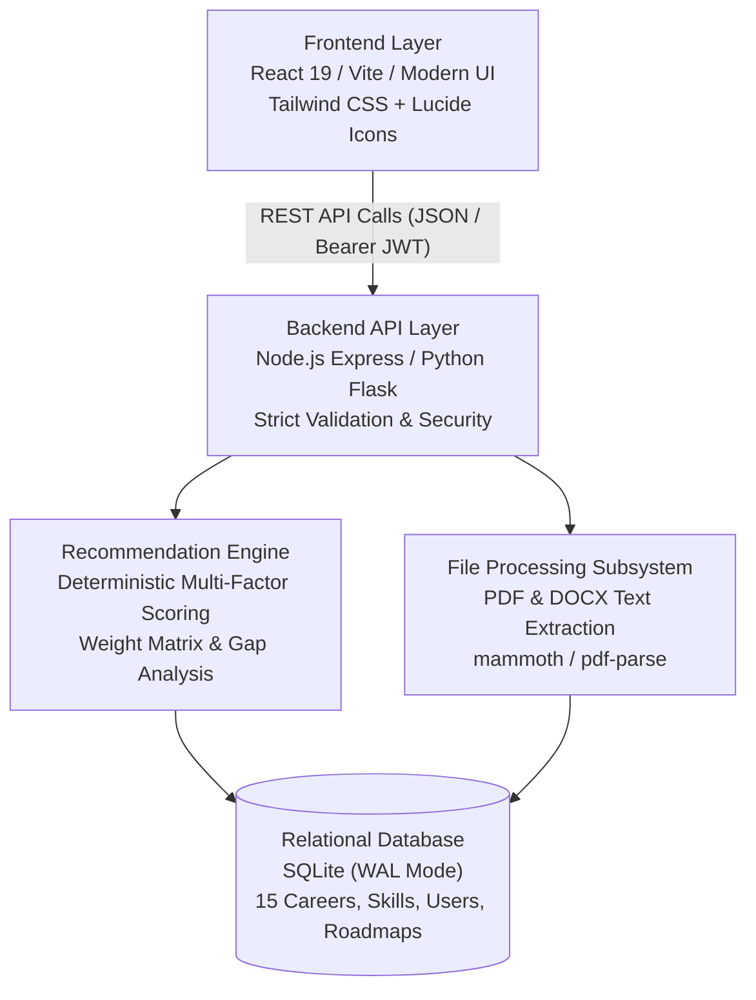

# FutureHub — Presentation & Viva Defense Master Guide
*A Complete Academic Presentation Summary for Computer Science & IT Students*

---

## 1. Quick Elevator Pitch (30-Second Intro)

### In English (Formal Presentation Mode)
> "Good morning, respected professors. Our project is **FutureHub**, an academic-tech career guidance platform specifically engineered for Computer Science and Information Technology students. Unlike commercial portals that provide generic quizzes or black-box predictions, FutureHub utilizes a **100% deterministic, explainable mathematical recommendation engine** that matches a student's technical skills, academic degree, domain interests, and practical experience to 15 curated IT career pathways. Furthermore, it provides personalized 5-stage progression roadmaps, hands-on portfolio projects, a comprehensive student profile identity center, and assisted CV/resume parsing to help students become industry-ready for campus placements."

### In Hinglish (Natural & Fluent Explanation Mode)
> "Good morning Sir/Ma'am. Hamara project hai **FutureHub – Career Guidance Platform**, jo especially Computer Science aur IT students ke liye banaya gaya hai. Aam taur par market mein jo career guidance websites hoti hain, wo black-box AI ya basic quiz use karti hain jisme student ko samajh nahi aata ki unhe koi career kyu recommend hua. FutureHub is problem ko solve karta hai ek **transparent mathematical formula** ke zariye — jisme student ke technical skills, domain interests, education level, aur practical experience ko calculate karke exact match percentage dikhaya jata hai. Saath hi sath, yeh har career ka complete 5-stage roadmap, placement portfolio projects, aur automated resume parser provide karta hai taaki student apne gap ko fill kar sake."

---

## 2. Problem Statement & Motivation (Why We Built This)

### Problem Statement
1. **Curriculum vs. Industry Mismatch**: College curriculum teaches theory, but campus placements require specific, modern tech stacks (e.g., REST APIs, Docker, System Design).
2. **Ambiguity in Career Choices**: Students know they want a job in IT, but struggle to choose between Frontend, Backend, DevOps, Data Science, or Cyber Security.
3. **Lack of Actionable Roadmaps**: Knowing "what to become" is not enough; students need to know "what step to take this month" (milestones, courses, and proof-of-work projects).
4. **Black-box Algorithms**: Most existing tools use opaque quiz logic where the recommendation cannot be justified during academic evaluations.

### How FutureHub Solves This (The Solution)
* **Explainability**: Every recommendation comes with clear justifications: *Matched Skills*, *Missing Skills*, and *Skill Gap Breakdown*.
* **Deterministic Math**: No random guesses. If two students submit identical profiles, they get identical, provable results.
* **Bridge to Placements**: Instead of just giving a career title, FutureHub gives concrete portfolio project ideas with code milestones.

---

## 3. System Architecture & Tech Stack

### Tech Stack Details & Justifications

| Layer | Technology | Why Chosen? (Viva Defense) |
| :--- | :--- | :--- |
| **Frontend** | React 19 / HTML5 + CSS3 | Fast rendering, responsive component architecture, and modern student-friendly UX. |
| **Backend** | Express (Node.js 24) / Flask (Python) | Lightweight, RESTful API routing, strict input validation, and asynchronous processing. |
| **Database** | SQLite 3 (with WAL Mode & Foreign Keys) | Zero-configuration, zero network latency overhead, ACID compliant, and easily portable for academic evaluation. |
| **Security** | JWT (JSON Web Tokens) & bcrypt | Stateless session management, password hashing, and anti-IDOR authorization checks. |
| **Parsing** | `pdf-parse` & `mammoth` | In-memory text stream extraction for PDF and Word resumes without external third-party paid APIs. |

---

## 4. The Recommendation Engine & Mathematical Formula
*(Most Important Section for Viva & Technical Evaluation)*

Professors will specifically ask: **"How does your algorithm work? Show me the logic."**

### The Core Formula

$$\text{Final Match Score} = (S \times 0.45) + (I \times 0.30) + (E \times 0.15) + (X \times 0.10) + D$$

### Variable Breakdown

| Factor | Weight | Parameter | Explanation |
| :--- | :---: | :--- | :--- |
| **$S$** | **45%** | **Technical Skills** | Core skills carry 1.5x weight, while secondary skills carry 1.0x weight. Evaluates exact coverage of candidate skills against career requirements. |
| **$I$** | **30%** | **Domain Interest** | Evaluates direct affinity and related-domain alignment between student interest and career field. |
| **$E$** | **15%** | **Education Level** | Checks degree eligibility (B.Sc CS, BCA, B.Tech, MCA) against entry benchmarks. |
| **$X$** | **10%** | **Practical Experience**| Evaluates student's hands-on project and internship depth (Beginner, 1–2 yrs, 3+ yrs). |
| **$D$** | **Bonus** | **Dream Career** | A subtle tie-breaker bonus (+4 points) applied only when the candidate explicitly targets that specific path. |

### How to Explain the Formula to Professors:
* **In English**:
  > "Sir, our algorithm uses a weighted multi-factor scoring model. We allocate the highest weight—45%—to Technical Skills, because practical competence is the primary hiring criterion in IT. Domain Interest receives 30% because motivation and career satisfaction drive long-term success. Education and Experience account for 15% and 10% respectively. Finally, a small affinity bonus of +4 points is given if the student has marked that pathway as their dream career, but it will never artificially boost an unqualified profile to 100%."
* **In Hinglish**:
  > "Sir, hamara scoring system 4 core factors par weighted average calculate karta hai. Technical Skills ko humne highest weightage 45% diya hai, kyunki IT industry me practical skills sabse critical hoti hain. Domain Interest ko 30% diya hai taaki student ka interest aur career match ho sake. Education level ko 15% aur practical experience ko 10% allocate kiya gaya hai. Is pure calculation se jo score nikalta hai, wo 100% transparent aur mathematical hota hai — koi arbitrary guessing ya black-box nahi hai."

---

## 5. Key Modules Walkthrough

### Module 1: Multi-Stage Student Assessment
* Collects: Degree program, current technical skill stack, domain interest, and experience level.
* Real-time client-side validation prevents invalid submissions.
* Submits payload to `/api/assessment` or `/api/recommend`.

### Module 2: Explainable Recommendation Output
* Displays **Top Ranked Career Matches** with percentage scores.
* **Skill Gap Analysis**: Shows *Skills You Have* (in green) and *Skills to Learn Next* (in orange/amber).
* Explains the exact natural-language reason behind the recommendation (e.g., *"You match 3 out of 4 core skills for Backend Development"*).

### Module 3: 5-Stage Progression Roadmaps
* Stage 1: Core Fundamentals
* Stage 2: Applied Tooling & Frameworks
* Stage 3: Database & Architecture
* Stage 4: Testing & Deployment
* Stage 5: Advanced Placement Readiness & System Design

### Module 4: CV / Resume Assisted Parser
* Students can upload `.pdf` or `.docx` resumes.
* The backend extracts text streams and matches them against the technical skills catalog.
* **Assisted Review Guarantee**: The system never silently mutates user profile data; it opens a verification modal where the student explicitly clicks *Accept*, *Edit*, or *Ignore*.

### Module 5: Student Profile Identity Center
* Manages 6 distinct academic sub-resources:
  1. Technical Skills (with proficiency rating: Beginner, Intermediate, Advanced)
  2. Formal Education History
  3. Internships & Work Experience
  4. Academic / Personal Projects
  5. Industry Certifications
  6. External Portfolio Links (GitHub, LinkedIn, LeetCode)
* Calculates an automated **Profile Completeness Score (0–100%)**.

---

## 6. Database Design & Relational Modeling

### Key Tables in `futurehub.db`
1. `careers`: Stores the 15 career pathways, category, salary brackets, and market demand.
2. `career_skills`: Normalization table linking careers to required/preferred skills with weighting.
3. `users`: Stores student credentials, hashed passwords (`bcrypt`), and registration timestamps.
4. `student_profiles`: Basic student demographic, academic year, degree, and bio.
5. `profile_skills`: Technical skills claimed by the student with proficiency levels.
6. `profile_projects`: Student portfolio items with repo URLs and tech tags.
7. `assessments`: History of student assessment submissions and historical match scores.
8. `resumes`: Metadata for uploaded resumes (stored securely on disk via UUID, not in web root).

---

## 7. Security & Architectural Best Practices

1. **Anti-IDOR / Anti-BOLA (Insecure Direct Object References)**:
   * Identification is always taken from verified JWT claims (`req.user.id`).
   * A student cannot edit or view another student's resume or profile simply by guessing their ID in the URL.
2. **Password Security**:
   * Passwords are never stored in plaintext. They are salted and hashed using `bcrypt` (10 rounds).
3. **Database Injection Protection**:
   * 100% of SQL queries use parameterized prepared statements (`?` placeholders). No string concatenation is used in SQL queries.
4. **Private Storage Isolation**:
   * Uploaded resumes are renamed with randomized UUIDs and saved in private disk directories outside public static web roots.

---

## 8. Top Viva Q&A (Professors' Favorite Questions)

### Q1: "What is unique about your project compared to existing career portals like LinkedIn or generic quiz sites?"
* **English Answer**:
  > "Existing portals either recommend jobs based on commercial keyword-scraping or give personality quizzes that lack technical depth. FutureHub is specifically tailored for computer science students. It uses a mathematical, explainable algorithm that highlights the exact technical skill gap, gives structured 5-stage placement roadmaps, and provides practical project ideas to make students hireable."
* **Hinglish Answer**:
  > "Sir, LinkedIn ya generic websites job postings dikhati hain ya unme theoretical personality quizzes hote hain. FutureHub specially college CS/IT students ke liye design kiya gaya hai. Yeh student ko sirf career title nahi deta, balki unhe batata hai ki unke paas kaunsi skills hain, agle semester me unhe kaunsi skill sikhni hai, aur placement me dikhane ke liye kaunsa project banana chahiye."

---

### Q2: "Why didn't you use a Deep Learning or ML model for recommendations?"
* **English Answer**:
  > "Machine Learning models require massive labeled datasets and behave like black boxes—meaning they cannot clearly justify *why* a particular percentage was produced. In an academic and campus placement advisory context, explainability is paramount. Our deterministic mathematical engine is 100% explainable, transparent, fast, and does not hallucinate recommendations."
* **Hinglish Answer**:
  > "Sir, Machine Learning models ko train karne ke liye lakho labeled data points chahiye hote hain aur wo 'black-box' hote hain — jisme examiner ya student ko exact reason explain karna mushkil hota hai. Career guidance me explainability sabse zaruri hai. Hamara mathematical formula student ko exact breakdown dikhata hai ki unka score 77% kyu aaya aur kaunsa skill missing hai."

---

### Q3: "Why did you choose SQLite instead of MongoDB or MySQL?"
* **English Answer**:
  > "For an academic-tech platform at this scale, SQLite provides full ACID compliance, zero-configuration deployment, and native Node.js / Python drivers with zero network latency. Because the database is stored as a structured file with WAL (Write-Ahead Logging) enabled, it is highly portable, fast for concurrent reads, and simple to demonstrate during evaluations without needing external database server daemons."
* **Hinglish Answer**:
  > "Sir, SQLite zero-configuration database hai jo pure ACID properties follow karta hai. Isme alag se MySQL ya MongoDB server daemon run karne ki zarurat nahi hoti, jisse evaluation aur viva demonstration me koi setup failure nahi hota. Saath hi Write-Ahead Logging (WAL mode) aur foreign key constraints use karke data integrity aur high read speed ensure ki gayi hai."

---

### Q4: "How does the Resume Parsing work? Does it automatically change student profile data?"
* **English Answer**:
  > "We parse the raw binary stream of `.pdf` and `.docx` files using `pdf-parse` and `mammoth` in-memory. We then tokenize the text and match it against our curated tech skills database. Most importantly, we follow an **Assisted Review Pattern**: the system suggests extracted skills as candidate proposals, but never automatically alters the student's profile without their explicit review and confirmation."
* **Hinglish Answer**:
  > "Sir, resume parsing ke liye backend me `pdf-parse` aur `mammoth` libraries use ki hain jo file se text stream extract karti hain. Phir regex aur catalog matching ke zariye technical keywords pehchane jaate hain. Humne ek safety rule rakha hai jise **Assisted Review** kehte hain — parsed skills direct database me save nahi hoti, pehle student ko review modal dikhta hai jahan wo Accept ya Ignore choose karta hai."

---

### Q5: "What are the future enhancements for this project?"
* **English Answer**:
  > "Future enhancements include: integrating AI-driven mock interview simulations based on missing skills, alumni mentor connection modules, and real-time live scrapers for local campus placement opening statistics."
* **Hinglish Answer**:
  > "Sir, future scope me hum isme AI-based mock interview question generator add kar sakte hain jo student ki missing skills par sawal puchega, plus alumni mentorship portal aur live campus placement notification system integrate kar sakte hain."

---

## 9. 10-Slide Presentation Quick Cheat Sheet

| Slide # | Slide Title | English Key Line | Hinglish Key Line |
| :---: | :--- | :--- | :--- |
| **1** | Title Slide | "FutureHub – Career Discovery & Student Profile Platform." | "FutureHub: CS/IT students ke liye career guidance platform." |
| **2** | Problem Statement | "Curriculum gap, career ambiguity, and lack of actionable placement roadmaps." | "Students ko theory aati hai par industry tech stack aur roadmap nahi pata hota." |
| **3** | Solution Overview | "Deterministic scoring, 5-stage roadmaps, and CV parsing." | "Transparent math engine, structured roadmaps, aur resume parser." |
| **4** | System Architecture | "Decoupled 3-tier architecture: React/HTML frontend, REST API, SQLite DB." | "3-tier architecture: Frontend, Backend REST API, aur SQLite database." |
| **5** | Scoring Algorithm | "Weighted multi-factor formula: 45% Skills, 30% Interest, 15% Education, 10% Experience." | "Formula: Skills 45%, Interest 30%, Degree 15%, Experience 10%." |
| **6** | Career Pathways | "15 curated IT specializations from Backend to DevOps and Data Science." | "15 demand IT careers with real industry salary brackets and roadmaps." |
| **7** | Student Identity Center | "6 profile subresources with automated 0-100% completeness tracking." | "Skills, projects, internships, links ko manage karne wala complete profile center." |
| **8** | CV Assisted Extraction | "Private disk storage, in-memory stream parsing, and assisted confirmation modal." | "Secure resume upload aur extracted skills ka student review system." |
| **9** | Security & Testing | "Anti-IDOR protection, bcrypt hashing, parameterized queries, and 44 unit tests." | "Complete security checks, password encryption, aur automated test suites." |
| **10** | Conclusion & Viva Demo | "FutureHub bridges the gap between student education and industry employment." | "Live demonstration of assessment, roadmap generation, and profile management." |
